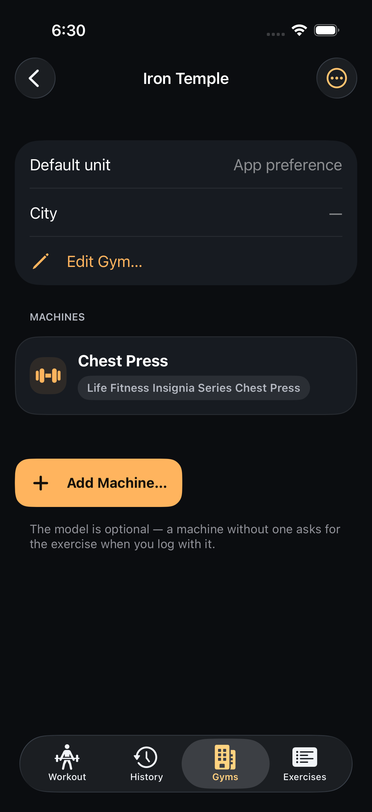
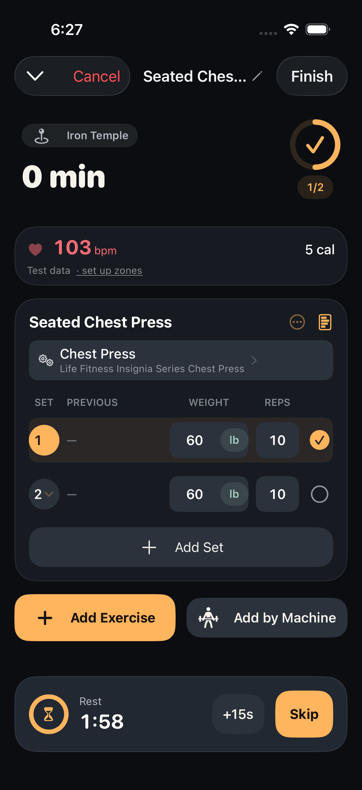
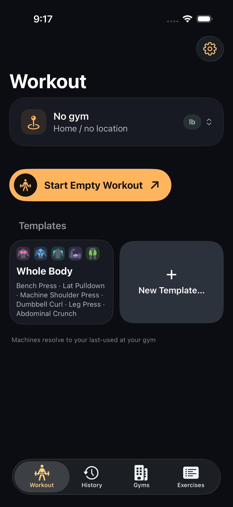
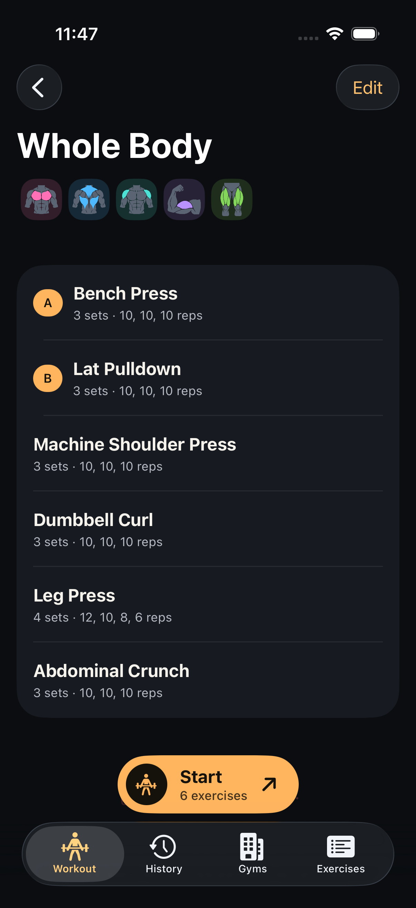
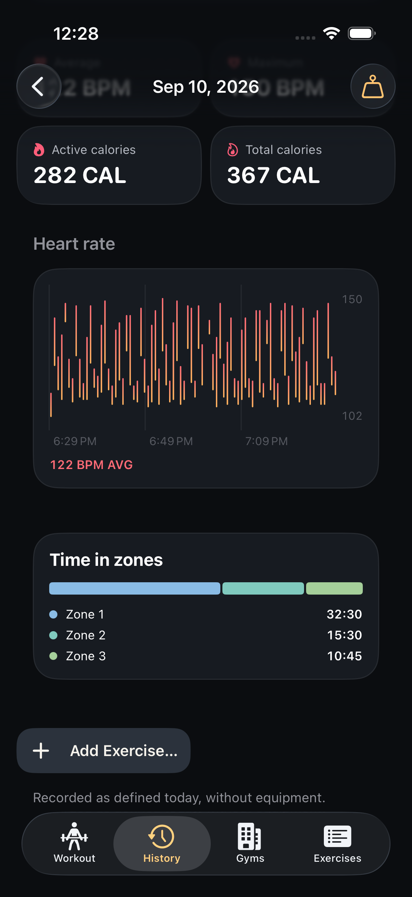

# Workout Tracker

A private iPhone workout logger that knows which machine you're on.

I move around a lot, and every gym has different equipment. In other trackers I had to log
everything under a generic "chest press" or "shoulder press", so a 60 kg set on one gym's
plate-loaded press and a 60 kg set on another's cable machine looked identical in my history
and nothing was comparable. This app anchors every set to a specific machine at a specific gym.
Previous performance, prefilled sets and records are per machine first, per equipment model
second, and per exercise only as a last resort — each layer labelled so you know what you're
comparing against.

<p>





</p>

## What it does

- **Gyms and machines.** Each gym has its own machines. Adding one can photograph its name
  plate: the phone reads it on device and matches it against a seeded catalog of 1,877
  equipment models from 23 manufacturers. Nothing leaves the phone unless you ask.
- **Fast logging.** Set rows arrive prefilled from your last session on that machine;
  confirming an untouched row is one tap. Weights keep the unit you entered, kg or lb, and
  are never silently converted.
- **Templates.** Save a finished workout as a plan and start it at any gym; each exercise
  resolves to the machine you last used there.
- **Heart rate.** Live bpm from AirPods or an Apple Watch, zones, calories, and a heart-rate
  rest timer; every session keeps its graph and time in zones.
- **History.** A calendar, per-session detail with editing, progress charts per exercise and
  variation, and CSV or JSON export of everything.

Strength only for now: one set shape, weight × reps. Dark UI, one accent, built for a glance
between sets.

## Building

Requires Xcode 26 and iOS 26. The simulator build needs no signing:

```sh
xcodebuild -project WorkoutTracker.xcodeproj -scheme WorkoutTracker \
  -sdk iphonesimulator -configuration Debug build
```

For a real phone, copy `Config/Local.xcconfig.example` to `Config/Local.xcconfig` with your own
team ID and bundle-ID prefix, then run `./scripts/install-on-device.sh`. Tests: the unit suite
runs in about a minute, the UI suite in about forty:

```sh
xcodebuild test -project WorkoutTracker.xcodeproj -scheme WorkoutTracker \
  -sdk iphonesimulator -destination 'platform=iOS Simulator,name=WT-iPhone' \
  -only-testing:WorkoutTrackerTests
```

## Layout

| Folder | What it holds |
|---|---|
| `WorkoutTracker/` | The app: `App/`, `Domain/` (SwiftData models and pure logic), `Features/` (one folder per screen), `Resources/` (the seeded catalog) |
| `WorkoutTrackerTests/`, `WorkoutTrackerUITests/` | Unit tests (Swift Testing) and end-to-end UI tests (XCTest) |
| `WorkoutTrackerWidget/` | The Live Activity for the rest timer |
| `WorkoutTrackerWatch/` | A placeholder Watch target; it has never been built or run |
| `docs/` | `SPEC.md` (what the product is), `DECISIONS.md` (why, D1–D54), `STATE.md` (where the project is right now) |
| `work-record/` | Every ticket with its acceptance criteria and resolution, every cross-review, and the screenshots each ticket was judged on |

## How it was built

Solo, with AI coding agents under a workflow described in [`CLAUDE.md`](CLAUDE.md): work is
split into numbered tickets; each ticket is built by one agent and cross-reviewed by a
different one (Claude and Codex) until it is clear; screens go through a written design
process with captures at the default and accessibility text sizes; and nothing merges without
the full test suite. The decision log and the work record are the paper trail.

Private project, single user, App Store release planned in the future.

